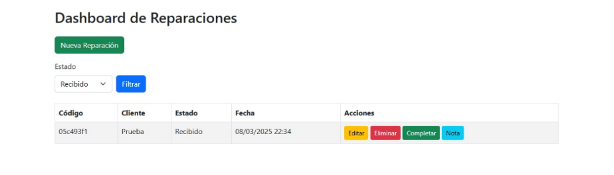

# PyFlask
Proyecto flask 

DIAGRAMA DE BASE DE DATOS:

## Abrir 

# Proyecto Flask Final

## Descripción
Este proyecto es una aplicación web construida con **Flask** que permite a los usuarios interactuar con diversas funcionalidades, incluyendo la creación de publicaciones y el seguimiento de otros usuarios.

## Requisitos

Antes de comenzar, asegúrate de tener instalados los siguientes programas:

- [Python 3.7+](https://www.python.org/downloads/)
- [Pip](https://pip.pypa.io/en/stable/)
- [SQLite](https://www.sqlite.org/download.html) (opcional si usas una base de datos diferente)

## Instrucciones de Instalación

Clona el repositorio: Si aún no tienes el repositorio en tu máquina local, clónalo con el siguiente comando: git clone https://github.com/RevengeSpeed/PyFlask

Accede al directorio del proyecto: Navega al directorio donde clonaste el repositorio: cd Flask-Final

Crea un entorno virtual: Se recomienda usar un entorno virtual para aislar las dependencias del proyecto. Crea un entorno virtual con el siguiente comando: python -m venv venv

Activa el entorno virtual:

En Windows, ejecuta: venv\Scripts\activate
En macOS/Linux, ejecuta: source venv/bin/activate
Instala las dependencias: Con el entorno virtual activo, instala las dependencias necesarias utilizando pip: pip install -r requirements.txt

Configuración de la base de datos: Si estás utilizando SQLite como base de datos, asegúrate de que el archivo de base de datos esté en la ubicación correcta, o crea una base de datos nueva si es necesario.

Ejecuta la aplicación: Inicia el servidor de Flask con el siguiente comando: python app.py

Accede a la aplicación: Una vez que el servidor esté en funcionamiento, abre tu navegador web y accede a: http://127.0.0.1:5000

## Capturas de pantalla funcionales.  

